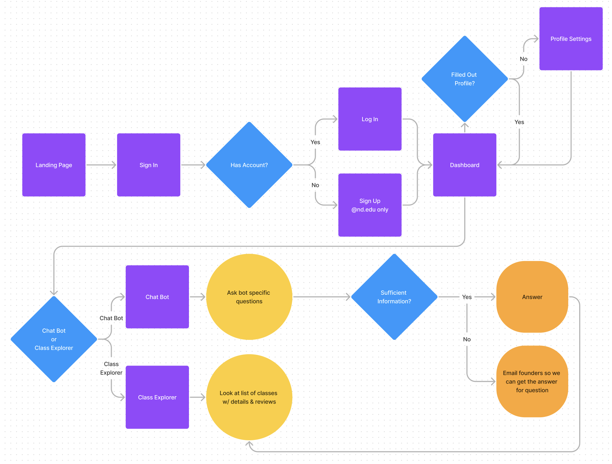
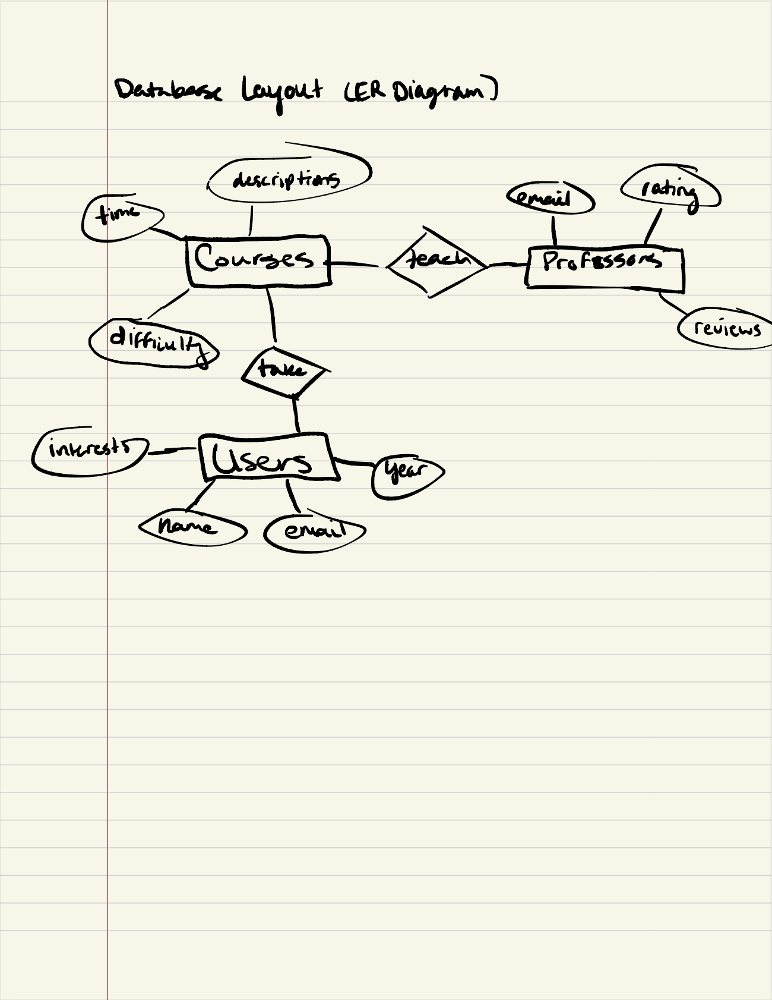
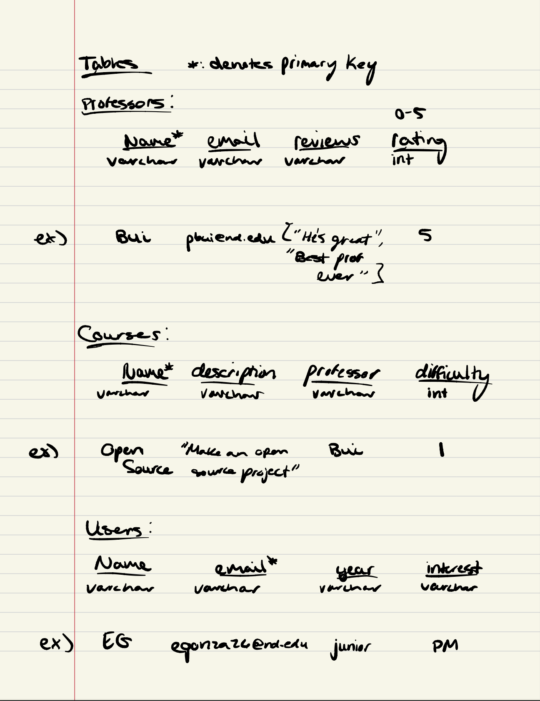
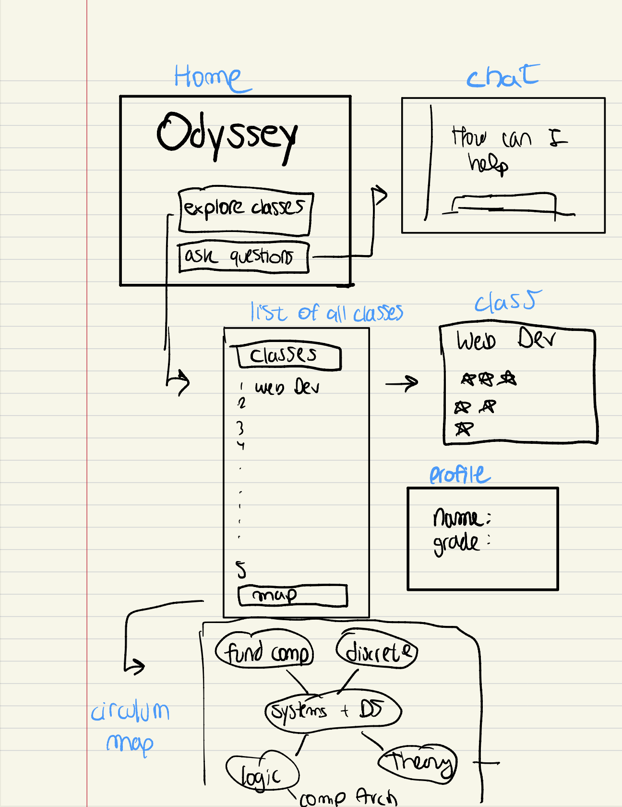
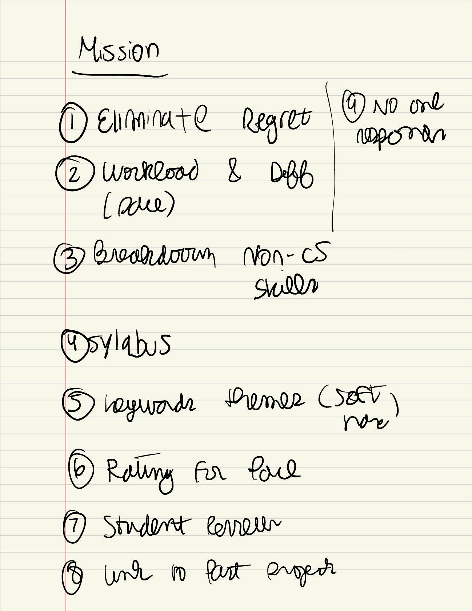

Choosing classes is a big deal.

One bad class can break the whole year. One great class can make the 4-year journey.

Yet, we only rely on half-reliable opinions from people giving half-efforted thoughts. And many of these opinions get lost in translation through the 20 people they're passed from.

That's why too many of us end up in...

Classes we skip.

Classes we deem miserable.

Classes we retain nothing about.

Classes we regret.

Classes are so important that we can't miss a lecture. Maybe we should reweigh the importance of comitting to a class for 16 weeks.

That's why Odyssey is embarking on making it easier for CSE students to choose classes that's right for their journey.

Let's help each other navigate to the right path.

Sincerely,

__________________________

## User Flow

## Database

## Contributors
We're a group of Notre Dame upperclassmen studying computer science. We know what it's like to ask around about what classes to take. And we know what it's like to be misled. We'll try to end that.

Dominick Blanco, Chase Dixon, Eriberto Gonzalez, Christian Matthew, Victoria Mendez
